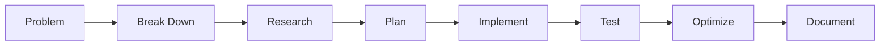

#  Hi there, I'm a MERN Stack Magician! 

<div align="center">
  
  
  [](https://github.com/YOUR_USERNAME)
  [](https://linkedin.com/in/your-profile)
  [](https://your-portfolio.com)
</div>

<div align="center">
  
</div>

## 🚀 Quick Overview

```javascript
const developer = {
  name: "YOUR_NAME",
  title: "Full Stack Developer",
  location: "YOUR_LOCATION",
  specialization: "MERN Stack",
  problemSolvingApproach: ["Break Down", "Analyze", "Implement", "Optimize"],
  currentFocus: "Building scalable web applications",
  funFact: "I debug with console.log and refuse to admit it 🤫"
};
```

## 💻 Tech Arsenal

<div align="center">
  
  
  
  
  
</div>

## 🎯 Current Stats

<div align="center">
  
</div>

<div align="center">
  
</div>

## 🏆 Featured Projects

### 1. E-Commerce Platform
> **Tech Stack:** MERN + Redux + Stripe
```javascript
const project = {
  highlights: [
    "Server-side rendering for SEO optimization",
    "Real-time inventory management",
    "Integrated payment gateway",
    "Advanced search with filters"
  ],
  metrics: {
    users: "1000+",
    transactions: "500+",
    uptime: "99.9%"
  }
};
```
[View Demo](your-demo-link) | [GitHub](your-repo-link)

### 2. Real-time Chat Application
> **Tech Stack:** MERN + Socket.io + WebRTC
```javascript
const features = {
  realTime: ["Message delivery", "Typing indicators"],
  media: ["Voice calls", "Video conferencing"],
  security: ["End-to-end encryption", "JWT authentication"]
};
```
[View Demo](your-demo-link) | [GitHub](your-repo-link)

## 🎯 Problem Solving Approach



## 📈 Coding Activity

<div align="center">
  
</div>

## 🌟 Skills Radar

```javascript
const skills = {
  frontend: {
    frameworks: ["React", "Next.js"],
    styling: ["Tailwind CSS", "Styled Components"],
    state: ["Redux", "Context API"]
  },
  backend: {
    runtime: "Node.js",
    framework: "Express.js",
    databases: ["MongoDB", "PostgreSQL"],
    caching: ["Redis", "Memory Cache"]
  },
  devOps: {
    cloud: ["AWS", "Vercel", "Heroku"],
    containers: "Docker",
    ci_cd: ["GitHub Actions", "Jenkins"]
  }
};
```

## 📫 Let's Connect!

<div align="center">
  
[](mailto:your.email@example.com)
[](https://linkedin.com/in/your-profile)
[](https://your-portfolio.com)

</div>

---

<div align="center">
  
</div>

<div align="center">
  <i>⭐️ If you like my projects, feel free to star them and make my day! ⭐️</i>
</div>